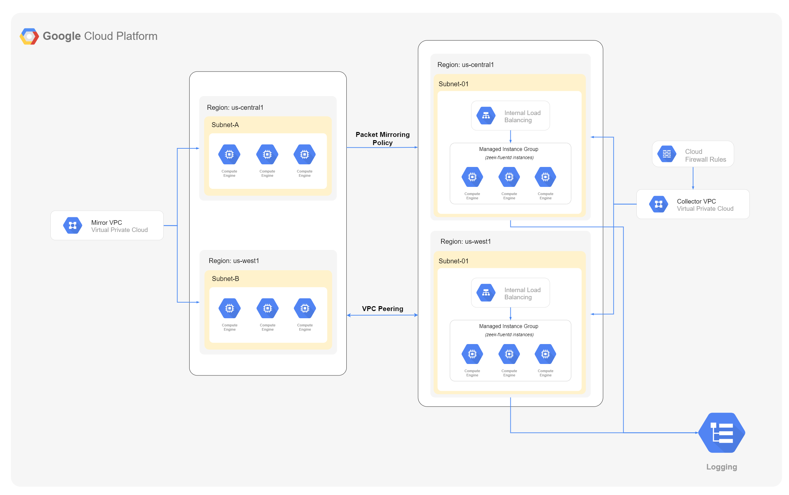

# Google Zeek Automation Module

This module simplifies the deployment of Zeek so GCP customers can feed raw packets from VPC Packet Mirroring and produce rich security telemetry for threat detection and investigation in our Chronicle Security Platform.

## Usage

Refer [usage](modules/zeek_automation/README.md#usage) section documented in modules directory.

## Examples

Examples of how to use these modules can be found in the [examples](examples) folder.

## Architecture

## Features

- Creates regional managed instance groups using same network peering between mirror-collector vpc for collecting logs from mirror vpc sources.
- Enables regional packet mirroring policies for mirroring mirror vpc sources like:
    - mirror-vpc subnets
    - mirror-vpc tags
    - mirror-vpc instances
  
  with optional parametes like: ip_protocols, direction, & cidr_ranges.
- Enables packaging of logs in order to send it to Chronicle Platform.  

## Learn

### Core concepts

- [VPC Network](docs/core-concepts/core-concepts.md#vpc-network)
- [Network Subnets](docs/core-concepts/core-concepts.md#network-subnets)
- [Network Firewall](docs/core-concepts/core-concepts.md#network-firewall)
- [VPC Network Peering](docs/core-concepts/core-concepts.md#vpc-network-peering)
- [Instance Template](docs/core-concepts/core-concepts.md#instance-template)
- [Managed Instance Group](docs/core-concepts/core-concepts.md#managed-instance-group)
- [Internal Load Balancer](docs/core-concepts/core-concepts.md#internal-load-balancer)
- [Packet Mirroring](docs/core-concepts/core-concepts.md#packet-mirroring)

### Repo organisation

This repo has the following folder structure:

- [root](./): The root folder contains an example of how to deploy Google Zeek Automation module.

- [modules](./modules/zeek_automation): This folder contains the main implementation code for this Module.

- [examples](./examples): This folder contains examples of how to use the module.

- [test](./test): Automated tests for the module.

## Contributions

Contributions to this repo are very welcome and appreciated! If you find a bug or want to add a new feature or even contribute an entirely new module, we are very happy to accept pull requests, provide feedback, and run your changes through our automated test suite.

Please see [contributing guidlines](CONTRIBUTING.md) for information on contributing to this module.
